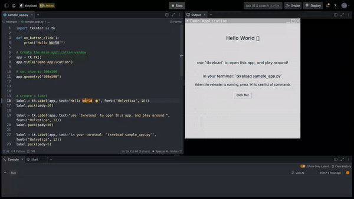
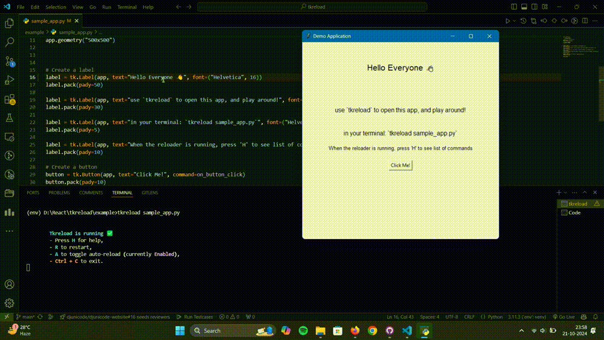

<div align="center">

# `tkreload`


<br />


[](https://opensource.org/licenses/MIT)

<p class="align center">
<h4><code>tkreload</code> is an open-source tool for automatically reloading terminal-based Python applications, saving developers valuable time.</h4>
</p>

[Installation](#installation) •
[Usage](#usage) •
[Contributing](#contributing) •
[Testing](#testing) •
[License](#license)

</div>

# Problem Statement
Developers often lose significant time manually restarting terminal applications during development. This process can be tedious and time-consuming, especially when working on complex projects that require frequent updates and testing.

# Time-Saving Analysis
Let’s assume that a developer restarts their terminal application approximately 15 times per day, and each reload takes 30 seconds. This adds up to 7.5 minutes daily or around 3.12 hours per month. Multiply that by the number of developers working on a project, and you quickly see how terminal reloading becomes a significant bottleneck in development productivity.

# Solution: tkreload
tkreload solves this issue by providing an automatic reload mechanism for terminal-based Python applications, particularly those using Tkinter. It eliminates the need for manual restarts, saving developers hours of time and streamlining the debugging process.

## Without tkreload


## With tkreload


# Getting Started

## Prerequisites
- Python 3.7+
- pip

## Installation

1. Clone the repository:
```sh
git clone https://github.com/iamDyeus/tkreload.git
cd tkreload
```

2. Create and activate a virtual environment:
```sh
python -m venv venv
source venv/bin/activate  # On Windows, use `venv\Scripts\activate`
```

3. Install the required dependencies:
```sh
pip install -r requirements.txt
```

4. Install tkreload:
```sh
pip install .
```

# Usage

To run the app with `tkreload`, use the following command in your terminal:

```bash
tkreload your_app.py
```

Now, whenever you save changes to your script, tkreload will automatically reload your application.

## Running Tests
Tests are critical to ensuring that the functionality and reliability of tkreload are maintained. Here's how you can run the test suite for the project:
1. Install Testing Dependencies
To run the tests, you will need to install the testing dependencies (e.g., pytest if it's being used). Make sure to install the dependencies from the requirements.txt file:
bash

# Contributing

Contributions are welcome and greatly appreciated! Here's how you can contribute:

1. Fork the Project
2. Create your Feature Branch (`git checkout -b feature/AmazingFeature`)
3. Commit your Changes (`git commit -m 'Add some AmazingFeature'`)
4. Push to the Branch (`git push origin feature/AmazingFeature`)
5. Open a Pull Request

# License

Distributed under the MIT License. See [`LICENSE`](LICENSE) for more information.

# Acknowledgments
- Inspired by the need for efficient development workflows
- Thanks to all contributors and supporters of this project

## Star History
[](https://star-history.com/#iamDyeus/tkreload&Date)